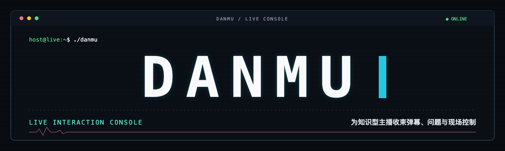
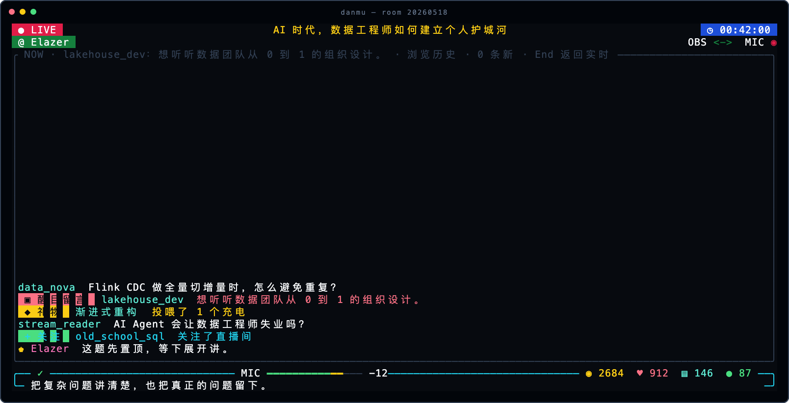
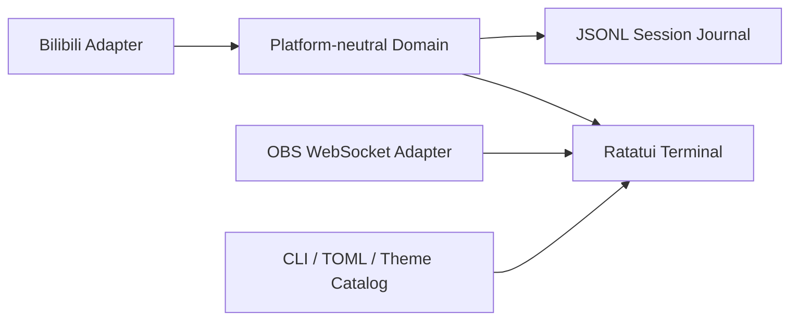

<p align="center">
  
</p>

<p align="center">
  <strong>为知识型主播收束弹幕、问题与现场控制。</strong><br>
  一块安静、快速、可恢复的直播互动终端。
</p>

<p align="center">
  <a href="https://github.com/rockythink/shisui-danmu/actions/workflows/ci.yml"></a>
  <a href="https://github.com/rockythink/shisui-danmu/releases/latest"></a>
  <a href="https://github.com/rockythink/shisui-danmu/blob/main/LICENSE"></a>
  
  
</p>

<p align="center">
  macOS · Linux · Windows &nbsp;|&nbsp; Bilibili &nbsp;|&nbsp; Ratatui &nbsp;|&nbsp; MPL-2.0
</p>

---

**DANMU** 是面向知识型主播的免费开源弹幕与提问工作台。它把 B 站的历史弹幕、实时互动、重点问题、发送状态和有限 OBS 控制放进同一个终端界面，让主播少盯几个窗口，多留一点注意力给正在讲的内容。

它不是播放器，也不是另一套 OBS。它只解决直播时最容易失控的那一段：**看见互动、辨认问题、快速回应、保留现场。**

<p align="center">
  
</p>

> 截图使用实际 Ratatui 渲染缓冲区和演示数据生成，不包含真实观众信息。

## 为什么做 DANMU

知识型直播的难点通常不是“弹幕不够多”，而是信息密度太高：问题夹在闲聊里，历史接口与实时 WebSocket 偶尔漏包，主播还要同时确认推流、场景和麦克风状态。

DANMU 把这些信号压缩成一块可扫读的终端界面：

- **不漏重要互动**：历史窗口与实时流合并、去重，断线自动重连；
- **问题留在眼前**：键盘选中弹幕、插入回复对象、设置重点消息；
- **发送结果可确认**：长弹幕按 Unicode 字素安全分段，并等待主播身份回流；
- **现场状态可感知**：直播状态、开播时长、看过、点赞、弹幕与在线人数分层显示；
- **OBS 只做必要的事**：场景、推流、静音和单路麦克风电平，不复制完整控制台；
- **结束后还有记录**：每场直播写入独立 Journal，可搜索并导出快照。

## 快速开始

### 1. 安装

macOS、Linux，以及 Windows 的 Git Bash：

```bash
curl -fsSL https://raw.githubusercontent.com/rockythink/shisui-danmu/main/script/install_release.sh | bash
```

安装脚本会识别操作系统与 CPU 架构，下载对应 GitHub Release，验证 SHA-256，并把可执行文件安装到 `~/.local/bin/danmu`。

Windows 也可以直接从 [Releases](https://github.com/rockythink/shisui-danmu/releases/latest) 下载 `shisui-danmu-windows-x86_64.zip`，校验同名 `.sha256` 后，将 `danmu.exe` 放入 `PATH`。

### 2. 进入直播间

```bash
danmu <房间号>
```

也可以显式传参：

```bash
danmu --room <房间号>
```

公开监看不需要登录。启动后按 `/` 打开命令面板，`↑/↓` 选择，`Enter` 执行。

### 3. 登录并发送弹幕（可选）

```bash
danmu --login
```

使用哔哩哔哩客户端扫码。登录成功后重新运行 `danmu <房间号>`，直接在底部输入框发送弹幕。

```bash
danmu --logout
```

`--logout` 只清除 DANMU 自己的 B 站登录态，不读取浏览器 Cookie，也不与其他应用共享凭据。

## 界面读法

| 区域 | 内容 |
| --- | --- |
| 顶部第一行 | `LIVE / OFFLINE / ROTATING`、直播标题、已开播时长 |
| 顶部第二行 | 主播身份、OBS 连接、麦克风静音状态 |
| Ghost Stage | 历史与实时事件合并后的主信息流；重点消息显示在标题上 |
| 通知区 | 登录、发送、重连、OBS 操作的进度、错误与可执行提示 |
| 输入框顶栏 | 发送状态、业务计数，以及空间允许时的麦克风电平 |
| 输入框 | Unicode 字素级编辑；最多四行，光标始终保持可见 |

底栏计数使用明确的数据口径：

| 符号 | 含义 | 来源 |
| --- | --- | --- |
| `◉` | 累计看过 | `WATCHED_CHANGE.data.num` |
| `♥` | 累计点赞 | `LIKE_INFO_V3_UPDATE.data.click_count` |
| `▤` | 本次运行收到的实时弹幕数 | 本地会话计数 |
| `●` | 当前在线人数 | 登录后读取 `getOnlineRank.data.onlineNum` |

`MIC` 电平来自 OBS WebSocket v5 的 `InputVolumeMeters` 事件：约 50 ms 接收一次，在 Adapter 内聚合为 10 Hz；上升立即响应，回落平滑。界面空间不足时先缩短电平条，再隐藏数值，极窄或 OBS 断连时完全隐藏。

## 键盘与命令

### 高频操作

| 操作 | 按键 |
| --- | --- |
| 打开命令面板 | `/` |
| 切换信息流 / 聊天布局 | `Tab` |
| 浏览历史 | 鼠标滚轮 |
| 回到最新消息 | `End` |
| 选择回复对象 | `Shift+↑/↓` |
| 插入 `@用户名` | 选择后按 `Enter` |
| 取消选择或退出 | `Esc` |
| 安全退出 | `Ctrl+C` 或 `/quit` |
| 行首 / 行尾 | `Home` / `End`，或 `Ctrl+A/E` |
| 删除到行首 / 删除前一个词 | `Ctrl+U/W` |

### TUI 命令

| 命令 | 作用 |
| --- | --- |
| `/help` | 显示命令面板操作提示 |
| `/login` · `/logout` | 扫码登录或清除独立登录态 |
| `/layout` | 切换信息流与聊天布局 |
| `/theme` | 打开主题选择；`/theme reload` 热加载自定义主题 |
| `/names show\|hide` | 显示或隐藏用户名 |
| `/time show\|hide` | 显示或隐藏消息时间 |
| `/feature` | 将当前选中消息设为重点 |
| `/archive [关键词]` | 搜索历史会话 |
| `/obs` · `/obs status` | 检查或查看 OBS 状态 |
| `/obs mute\|unmute` | 静音或取消静音所配置的麦克风 |
| `/obs scene [名称]` | 列出或切换场景 |
| `/obs config mic [名称]` | 列出或选择单路麦克风输入 |
| `/obs start` | 开始推流 |
| `/obs stop` | 请求停止推流；必须再执行 `/obs confirm` |
| `/obs cancel` | 取消待确认的停止推流操作 |
| `/quit` | 安全退出并写入会话状态 |

## OBS 接入

DANMU 使用 OBS 28+ 内置的 WebSocket v5，**不依赖 `obs-cli`、Python 或额外桥接进程**。

1. 在 OBS 中打开 **工具 → WebSocket 服务器设置**；
2. 启用 WebSocket 服务器，记下端口与密码；
3. 运行配置向导：

   ```bash
   danmu --configure-obs
   ```

4. 依次填写主机、端口、默认直播场景和麦克风输入名；
5. 进入 TUI 后运行 `/obs status` 验证连接。

密码保存到系统凭据存储；主机、端口、场景与输入名写入 DANMU 独立配置。停止推流始终需要二次确认。

## 配置与主题

### 启动参数

```text
danmu [房间号]
      [--room <房间号>]
      [--single-line <true|false>]
      [--show-time <true|false>]
      [--show-name <true|false> | --hide-name]
      [--theme <主题名>]
      [--config <路径>]
```

运行 `danmu --help` 查看完整参数。

### TOML 配置

```toml
room_id = "123456"
single_line = true
chat_layout = false
show_time = true
show_name = true
```

CLI 参数优先于 TOML。可通过 `--config <路径>` 使用指定配置文件。

### True Color 主题

内置四套深色主题：

- `shisui`
- `catppuccin-mocha`
- `tokyo-night`
- `gruvbox-dark`

```text
/theme
/theme tokyo-night
/theme reload
```

首次运行会生成 `themes.json`。输入 `/theme` 可查看当前实际路径。复制现有主题对象并修改 ID、`label` 与十个 `#RRGGBB` 语义色，即可创建自定义主题；保存后执行 `/theme reload`，不必重启。

## 数据、凭据与恢复

DANMU 使用独立命名空间，不读取商业 GUI、浏览器或其他直播工具的数据：

- B 站 Cookie / CSRF：独立 `BilibiliAccount/session.json`，Unix 权限 `0600`；
- OBS 密码：系统凭据存储；
- OBS 非敏感配置：独立 `obs-control.json`；
- 主题与启动配置：平台配置目录中的 `shisui-danmu/`；
- 会话记录：每场直播一个目录，持续追加 `journal.jsonl`；
- 正常结束：额外生成 `snapshot.json` 与 `summary.md`；
- 异常退出：下次进入同一房间时恢复未结束会话。

Cookie、CSRF 和原始 B 站 payload 不进入领域事件或会话导出。

## 架构



- `src/bilibili/`：房间解析、历史补偿、WebSocket、账号与发送；
- `src/domain/`：标准事件、会话、指标、去重与问题分类；
- `src/obs.rs`、`src/obs/`：有限 OBS 控制与电平聚合；
- `src/terminal/`：Ratatui 渲染、输入、二维码与电平表；
- `src/persistence.rs`：追加式 Journal、恢复、搜索和导出。

平台协议只存在于 Adapter。领域 Module 不依赖 B 站原始字段。

## 能力边界

DANMU 有意保持克制：

**包含**：公开房间监看、历史与实时事件去重、自动重连、登录后发送、重点互动、会话归档、True Color 主题、有限 OBS 控制、单路麦克风电平。

**不包含**：播放器、完整直播画布、音频混音台、录制与 Replay Buffer、OBS 场景编辑器、商业 GUI。

完整行为基线见 [终端舞台功能矩阵](docs/terminal-feature-matrix.md)。

## 从源码构建

需要 Rust 1.89 或更高版本：

```bash
git clone https://github.com/rockythink/shisui-danmu.git
cd shisui-danmu
cargo build --release --locked
```

安装到 `~/.local/bin/danmu`：

```bash
./script/install_cli.sh
```

或使用 Cargo：

```bash
cargo install --locked --path .
```

## 开发与验证

```bash
./script/verify.sh
```

完整门禁包含：

- `cargo fmt --check`
- 严格 `clippy`
- 全目标测试
- Release 构建
- CLI 冒烟

GitHub Actions 在 macOS、Linux、Windows 上执行对应 Rust 门禁。提交前请阅读 [CONTRIBUTING.md](CONTRIBUTING.md)。

## Release 资产

| 平台 | 文件 |
| --- | --- |
| macOS Apple Silicon | `shisui-danmu-macos-aarch64.tar.gz` |
| macOS Intel | `shisui-danmu-macos-x86_64.tar.gz` |
| Linux x86_64 | `shisui-danmu-linux-x86_64.tar.gz` |
| Linux aarch64 | `shisui-danmu-linux-aarch64.tar.gz` |
| Windows x86_64 | `shisui-danmu-windows-x86_64.zip` |

指定版本或安装目录：

```bash
curl -fsSL https://raw.githubusercontent.com/rockythink/shisui-danmu/main/script/install_release.sh | \
  DANMU_VERSION=v0.4.0 DANMU_INSTALL_DIR="$HOME/bin" bash
```

卸载：

```bash
curl -fsSL https://raw.githubusercontent.com/rockythink/shisui-danmu/main/script/install_release.sh | bash -s -- --uninstall
```

卸载只删除可执行文件，不删除配置、系统凭据或会话日志。

## License、商标与安全

源代码按 [Mozilla Public License 2.0](LICENSE) 发布，第三方组件见 [THIRD_PARTY_NOTICES.md](THIRD_PARTY_NOTICES.md)。MPL-2.0 不授予 **DANMU** 名称、Logo、App 图标或其他品牌资产的商标许可，详见 [TRADEMARKS.md](TRADEMARKS.md)。

安全问题请按 [SECURITY.md](SECURITY.md) 私下报告。不要在公开 Issue 中提交 B 站 Cookie、CSRF token、OBS 密码、系统凭据存储内容或本机会话日志。
